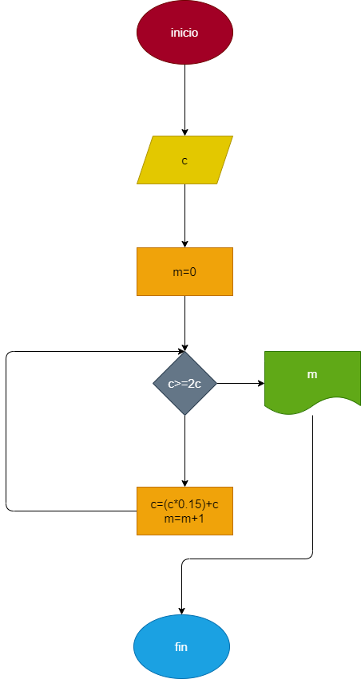

# Interes_compuesto: Hacer el diagrama e flujo y el programa en python, que lea un capital c y que averigue e imprima en cuantos meses se duplica, si lo colocamos a un interes compuesto de 5% mensual. 

## Diagrama de flujo 
